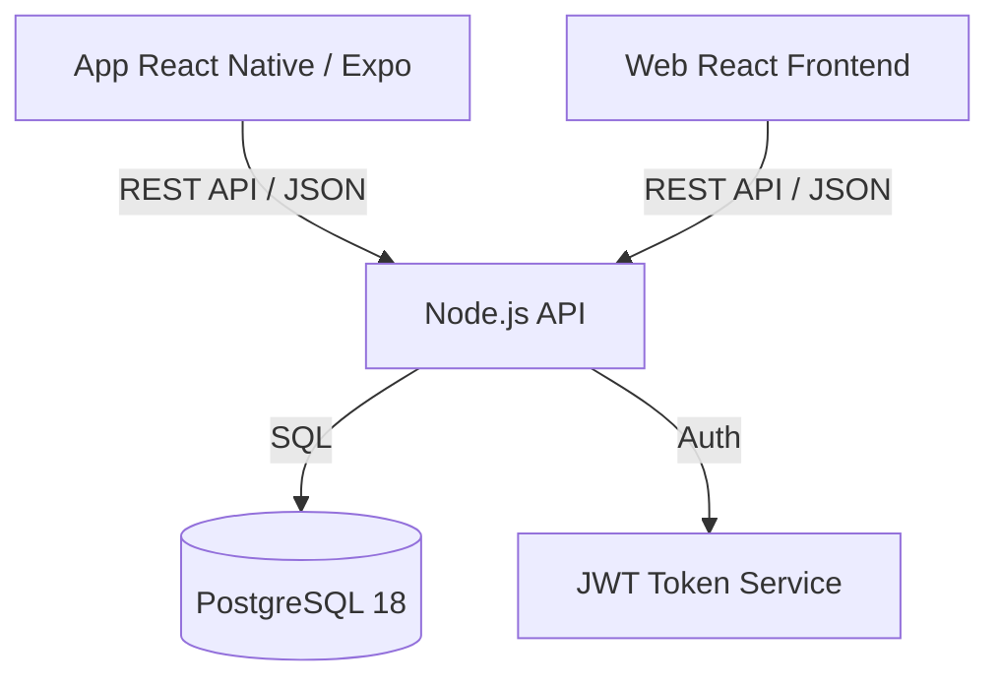

# Planejamento MVP - SuporteIS Mobile

Este documento define o Produto Mínimo Viável (MVP) para a extensão móvel do sistema SuporteIS, baseado nas diretrizes de arquitetura e objetivos identificados no plano original.

## 1. Definição do Escopo Mínimo Viável
Desenvolver um aplicativo móvel (Android/iOS) utilizando React Native e Expo que atue como uma interface cliente para o sistema SuporteIS existente. O objetivo é permitir que técnicos e clientes realizem operações críticas de suporte (abertura, acompanhamento e resolução de chamados) remotamente, consumindo a mesma API e regras de negócio da versão Web.

## 2. Funcionalidades Essenciais Priorizadas

### Prioridade Alta (Lançamento)
- **Autenticação:** Login seguro com e-mail/senha e persistência de sessão (JWT).
- **Dashboard/Listagem:** Visualização de lista de chamados com filtros básicos (Status, Prioridade).
- **Detalhes do Chamado:** Visualização completa das informações, histórico e status.
- **Interação:** Envio e recebimento de mensagens dentro do chamado.
- **Criação de Chamado:** Abertura de novos tickets simplificada.

### Prioridade Média (V1.1)
- **Multimídia:** Captura e upload de fotos direto da câmera para o chamado.
- **Notificações:** Push notifications para novas mensagens e mudanças de status.
- **Avaliação:** Interface para cliente avaliar atendimento finalizado.

### Prioridade Baixa (Futuro)
- **Modo Offline:** Visualização de dados em cache sem internet.
- **Geolocalização:** Registro de local de atendimento.
- **Chat em Tempo Real:** WebSockets para comunicação instantânea.

## 3. Arquitetura Básica Proposta

A arquitetura segue o padrão **Client-Server** estrito, onde o Mobile é apenas uma "casca" visual.

- **Frontend:** React Native + Expo (Gerenciamento de UI e Hardware).
- **Backend:** Node.js (Camadas: Controllers, Services, Repositories).
- **Estado Local:** Context API ou Zustand para gerenciamento de sessão/cache simples.
- **Armazenamento Seguro:** `expo-secure-store` para tokens.

## 4. Fluxos de Trabalho Principais

1.  **Acesso Técnico:**
    *   Login -> Dashboard (Meus Chamados) -> Selecionar Chamado -> Ler Histórico -> Responder/Alterar Status.
2.  **Solicitação Cliente:**
    *   Login -> Botão "Novo Chamado" -> Preencher Assunto/Desc -> Tirar Foto (Opcional) -> Enviar.
3.  **Ciclo de Vida do Token:**
    *   Login -> Recebe Token -> Salva no Device -> Requests com Header `Authorization` -> Token Expira -> Logout/Refresh Automático.

## 5. Requisitos Técnicos Fundamentais

-   **Backend Existente:** API deve expor endpoints RESTful para todas as operações (Auth, Tickets, Messages).
-   **Segurança:** Implementação de JWT e validação de dados no Backend (Zod/Joi).
-   **Conectividade:** Cliente HTTP (Axios) configurado com interceptors para gestão de tokens e tratamento de erros 401.
-   **Navegação:** `react-navigation` configurado com Stacks e Tabs.
-   **Ambiente:** Node.js LTS, Expo CLI, PostgreSQL.

## 6. Cronograma Estimado (4 Semanas)

| Semana | Foco | Entregáveis |
| :--- | :--- | :--- |
| **1** | **Setup & Auth** | Configuração Expo, Integração Login, Persistência de Token. |
| **2** | **Leitura de Dados** | Listagem de Chamados, Filtros, Tela de Detalhes. |
| **3** | **Escrita & Interação** | Envio de mensagens, Criação de Chamados, Formulários. |
| **4** | **Refino & Mobile** | Integração Câmera, Testes de Usabilidade, Build Inicial. |

## 7. Métricas de Sucesso para Validação

1.  **Funcional:** 100% das operações críticas (Login, Criar, Responder) funcionam sem erros na API.
2.  **Performance:** Tempo de carregamento da lista de chamados < 2 segundos em 4G.
3.  **Usabilidade:** Técnicos conseguem responder um chamado com menos de 3 toques após abrir o app.
4.  **Adoção:** 100% da equipe de suporte instalando e logando no aplicativo na primeira semana de beta.
